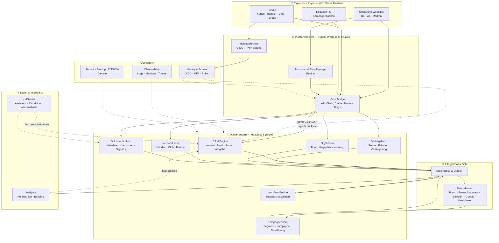

# 01 — Gesamtarchitektur

## 1. Architekturprinzipien

Diese neun Prinzipien entscheiden jeden Zweifelsfall in den folgenden
Dokumenten. Wo ein Detail dieser Architektur einem Prinzip widerspricht, ist das
Detail falsch.

| Nr. | Prinzip | Konsequenz |
|---|---|---|
| **P1** | **WordPress ist das Gesicht, der Domänenkern ist das Gedächtnis.** | Kein Vertrag, keine Einwilligung, kein Auditeintrag liegt in `wp_posts` oder `wp_postmeta`. |
| **P2** | **Je Datum genau ein System of Record.** | Alles andere ist Read Model und darf keine Entscheidung begründen. |
| **P3** | **Kein gemeinsamer Datenbankzugriff zwischen Systemen.** | Integration ausschließlich über API und Ereignisse. Ein Systemwechsel bricht dann nichts Fremdes. |
| **P4** | **Ereignisse vor Abfragen.** | Zustandsänderungen erzeugen Ereignisse. Nachgelagerte Module reagieren, statt zu pollen. |
| **P5** | **Jede Entscheidung ist erklärbar.** | Jeder Score nennt seine Top-Faktoren, jede Automatisierung erzeugt einen Auditeintrag, jede KI-Ausgabe trägt Herkunft und Sicherheit. |
| **P6** | **Mandantenfähigkeit ab Tag eins im Schlüssel, nicht ab Tag eins im Betrieb.** | Jede Kerntabelle trägt `mandant_id`, auch wenn zunächst nur ein Mandant existiert. Nachrüsten wäre eine Migration über alle Daten. |
| **P7** | **Datenschutz ist Modellbestandteil, nicht Nachrüstung.** | Zweck, Rechtsgrundlage, Aufbewahrung und Löschweg sind an der Entität modelliert. |
| **P8** | **Kein Datum ohne Verwendung.** | Ein Feld, das keine Regel, keine Auswertung und keine Aufgabe speist, wird nicht erhoben. |
| **P9** | **Fremdsysteme sind austauschbar.** | Brevo, Power Automate, KI-Anbieter, Signatur und Versicherer liegen hinter Adaptern. Kein Anbietername im Domänenkern. |

---

## 2. Schichtenmodell

**Lesart der Kanten:** Durchgezogen bedeutet Besitz oder Steuerung, gestrichelt
bedeutet ausschließlich lesenden Zugriff. Die KI-Schicht hat keine einzige
schreibende Kante in den Domänenkern — sie schlägt vor, sie entscheidet nicht.

---

## 3. Systeme und Verantwortlichkeiten

### 3.1 Übersicht

| ID | System | Schicht | Besitzt (System of Record) | Besitzt **nicht** |
|---|---|---|---|---|
| **S1** | Public Web | ① | Inhalte, Seiten, Medien, SEO-Metadaten, Navigation | Personen, Leads, Verträge |
| **S2** | Portale | ① | Portal-Konfiguration, Ansichten, Übersetzungen | Alle Fachdaten (nur Anzeige) |
| **S3** | Core Bridge | ② | Cache-Zustand, Feature Flags, Zuordnung WP-Benutzer ↔ Kern-Identität | Nichts Fachliches |
| **S4** | CRM Engine | ③ | Kontakt, Lead, Aktivität, Score, Aufgabe, Einwilligung | Vertrag, Boot, Dokumentinhalt |
| **S5** | Vertragskern | ③ | Vertrag, Prämie, Deckung, Verlängerung, Vertragsdokumentbezug | Person (nur Referenz) |
| **S6** | Objektkern | ③ | Boot, technische Daten, Liegeplatz, Nutzungsart, Wert | Vertrag |
| **S7** | Netzwerkkern | ③ | Organisation, Organisationsrolle, Standort, Vereinbarung, Provisionsregel | Personen der Organisation (nur Verknüpfung zu Kontakt) |
| **S8** | Workflow Engine | ③ | Vorgangsinstanz, Zustand, Übergang, Frist, Eskalation | Fachdaten des Vorgangs |
| **S9** | Dokumentenkern | ③ | Dokument-Metadaten, Versionen, Prüfsummen, Signaturstatus, Aufbewahrung | Dokumentinhalt (liegt im Objektspeicher) |
| **S10** | Kampagnenkern | ③ | Kampagne, Segmentdefinition, Versandnachweis, Widerspruchsstatus | Versandinfrastruktur (Brevo) |
| **S11** | Ereignisbus | ④ | Ereignisprotokoll, Zustellstatus | Fachdaten |
| **S12** | Konnektoren | ④ | Zuordnung interner ↔ externer Kennungen | Fachdaten |
| **S13** | Analytics | ⑤ | Kennzahlendefinitionen, aggregierte Zeitreihen | Nichts Operatives |
| **S14** | KI-Dienste | ⑤ | Wissensbasis-Index, Prompt- und Modellversionen, Ausgabeprotokoll | Nichts Fachliches |
| **S15** | Identity & Access | ⚡ | Benutzer, Anmeldeverfahren, Rollenzuweisung, Sitzungen | Fachliche Berechtigungslogik (liegt im Kern) |

### 3.2 Warum Händler, Club und Partner ein System teilen

Händler, Bootsclub und Partner sind aus Datensicht dasselbe: eine Organisation
mit Anschrift, Ansprechpartnern, einer Vereinbarung und einer Abrechnungsregel.
Sie unterscheiden sich in Rolle, Konditionen und Portalansicht — nicht in
Struktur.

Drei getrennte Systeme hätten drei Adressverwaltungen, drei Kontaktzuordnungen
und drei Stellen zur Pflege derselben Stammdaten zur Folge. Deshalb: **ein
Netzwerkkern (S7), drei Rollen, drei Portalansichten.**

Siehe [`adr/0004-organisation-mit-rollen.md`](adr/0004-organisation-mit-rollen.md).

### 3.3 Warum der Vertragskern vom CRM getrennt ist

Das CRM lebt von Bewegung: Scores ändern sich täglich, Aufgaben entstehen und
verfallen, Signale strömen ein. Der Vertragskern lebt von Beständigkeit: eine
Police gilt unverändert, bis sie geändert wird, und jede Änderung ist ein
nachweispflichtiger Vorgang.

Zwei Systeme mit gegensätzlichem Änderungsrhythmus in einer Datenbank zu
führen, bedeutet, dass die Anforderungen der einen Seite die andere behindern.
Getrennte Systeme erlauben es außerdem, den Vertragskern später an einen
Versicherer, ein Bestandsführungssystem oder ein Maklerverwaltungsprogramm
anzubinden, ohne das CRM anzufassen.

---

## 4. Beziehungen zwischen den Systemen

### 4.1 Aufrufmatrix

`S` = synchroner Aufruf (Antwort wird gebraucht), `E` = Ereignis (asynchron),
`R` = lesender Zugriff auf ein Read Model, `—` = keine Beziehung.

| von ↓ / nach → | S4 CRM | S5 Vertrag | S6 Objekt | S7 Netzwerk | S8 Workflow | S9 Dokument | S10 Kampagne | S13 Analytics |
|---|---|---|---|---|---|---|---|---|
| **S1/S2 WordPress** | S | S | S | S | — | S | — | — |
| **S4 CRM** | — | R | R | R | E | R | E | E |
| **S5 Vertrag** | E | — | R | R | E | E | E | E |
| **S6 Objekt** | E | E | — | — | — | — | — | E |
| **S7 Netzwerk** | E | R | — | — | E | — | E | E |
| **S8 Workflow** | S | S | — | — | — | S | S | E |
| **S9 Dokument** | E | E | — | — | E | — | — | E |
| **S10 Kampagne** | R | — | — | R | E | — | — | E |
| **S14 KI** | R | R | R | R | — | R | — | R |

**Auffällig und beabsichtigt:** Die Zeile S14 (KI) enthält ausschließlich `R`.
Die Spalte S13 (Analytics) enthält ausschließlich `E`. Beide Schichten können
den operativen Betrieb nicht beschädigen.

### 4.2 Synchron oder asynchron

| Situation | Muster | Begründung |
|---|---|---|
| Portal zeigt Vertragsdaten an | synchron, Antwortzeit < 300 ms | Der Nutzer wartet. Bei Ausfall: Hinweis statt Fehlerseite. |
| Lead entsteht aus einem Formular | synchron anlegen, danach Ereignis | Der Absender braucht sofort eine Bestätigung; alles Weitere kann warten. |
| Newsletter-Anmeldung nach Brevo | asynchron über Outbox | Ein Ausfall von Brevo darf kein Formular scheitern lassen. |
| Score-Neuberechnung | asynchron, nächtlich und ereignisgetrieben | Rechenintensiv, nicht zeitkritisch. |
| Verlängerungslauf | asynchron, terminiert | Betrifft tausende Verträge gleichzeitig. |
| Dokument-Upload | synchron speichern, asynchron scannen und verarbeiten | Der Nutzer braucht Bestätigung, der Virenscan dauert. |
| KI-Entwurf im Portal | synchron mit Zeitgrenze, Rückfall auf Vorlage | Der Nutzer wartet, aber der Dienst darf nicht blockieren. |

---

## 5. Bounded Contexts und Sprachgrenzen

Derselbe Begriff bedeutet in verschiedenen Systemen Verschiedenes. Diese
Übersetzungen sind verbindlich und in [`04_DATENMODELL.md`](04_DATENMODELL.md)
im Detail belegt.

| Begriff | Im CRM (S4) | Im Vertragskern (S5) | Im Netzwerkkern (S7) | Auf der Website (S1) |
|---|---|---|---|---|
| Person | `Kontakt` — eine natürliche Person | `Versicherungsnehmer` — Vertragspartei | `Ansprechpartner` — Rolle in einer Organisation | „Interessent" / „Kunde" |
| Wirtschaftliche Einheit | `Kunde` — hat mindestens einen Vertrag | `Vertragspartner` | `Organisation` | „Mein Konto" |
| Absicht | `Lead` — bewertbare Vertriebsabsicht | existiert nicht | `Empfehlung` | „Anfrage" |
| Objekt | `Boot` (Read Model) | `versichertes Objekt` | `Bestandsobjekt` beim Händler | „Mein Boot" |

Die Übersetzung findet **an der Systemgrenze** statt, nicht im Kopf der
Entwickelnden. Jeder Konnektor und jede API-Antwort führt die Zuordnung
explizit.

---

## 6. Verfügbarkeitsklassen

Nicht jedes System braucht dieselbe Verfügbarkeit. Aufwand dorthin zu lenken,
wo Ausfall wehtut, ist Teil der Architektur.

| Klasse | Systeme | Ziel Verfügbarkeit | RPO | RTO | Verhalten bei Ausfall |
|---|---|---|---|---|---|
| **A — geschäftskritisch** | S4 CRM, S5 Vertragskern, S15 Identity | 99,9 % | 15 min | 1 h | Kein Datenverlust zulässig. Wartungsseite, Datenerfassung gesperrt. |
| **B — kundenwirksam** | S1 Web, S2 Portale, S9 Dokumente | 99,5 % | 1 h | 4 h | Statische Notfallseite, Kontaktweg bleibt sichtbar. |
| **C — verzögerbar** | S8 Workflow, S10 Kampagnen, S11 Bus | 99,0 % | 4 h | 8 h | Arbeit staut sich in der Warteschlange und läuft nach. |
| **D — nachrangig** | S13 Analytics, S14 KI | 95,0 % | 24 h | 24 h | Funktion entfällt sichtbar, Betrieb läuft weiter. |

**Wichtig für die Umsetzung:** Klasse D darf nie zur Voraussetzung für Klasse A
werden. Ein ausgefallener KI-Dienst darf keine Antragsstrecke blockieren. Das
wird durch Zeitgrenzen und Rückfallpfade erzwungen, nicht durch Zusicherungen.

---

## 7. Was diese Architektur ausschließt

| Ausgeschlossen | Grund |
|---|---|
| Fachdaten in `wp_postmeta` | Keine Relationen, keine Typsicherheit, keine Mandantentrennung, unbrauchbar für Nachweise (P1). |
| Direkter Datenbankzugriff zwischen Systemen | Macht jede Schemaänderung zum systemübergreifenden Vorfall (P3). |
| WordPress als Verwalter personenbezogener Vertragsdaten | Rechte- und Plugin-Modell nicht auf Objektebene absicherbar. |
| Ein einziges Plugin, das „alles" kann | Nicht testbar, nicht ablösbar, nicht mandantenfähig. |
| Microservices je Modul | Elf Dienste für ein Team dieser Größe erzeugen mehr Betriebsaufwand als Nutzen. Der Domänenkern startet als modularer Monolith. |
| KI mit Schreibrecht auf Fachdaten | Eine nicht überprüfte Ausgabe darf keinen Vertragszustand ändern (P5). |
| Screen Scraping fremder Portale | Ohne schriftliche Erlaubnis rechtlich und betrieblich nicht tragbar. |
| Speicherung außerhalb EU/EWR | Vorgabe der Plattform, siehe [`08_SICHERHEITSARCHITEKTUR.md`](08_SICHERHEITSARCHITEKTUR.md). |
