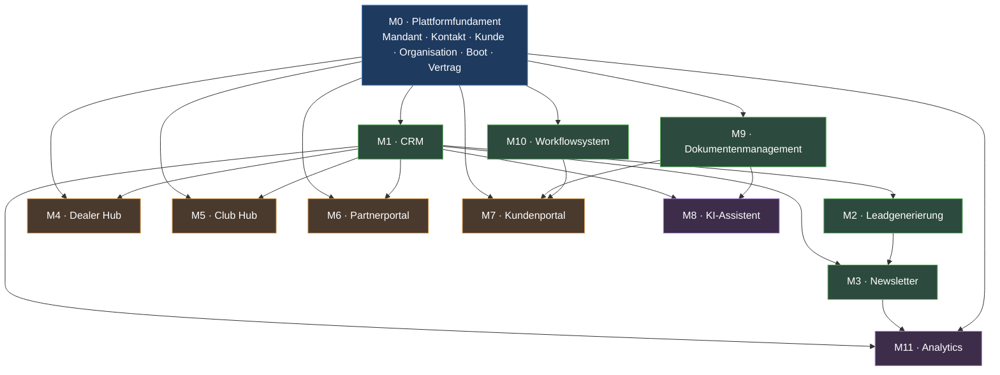

# 03 — Modulübersicht

## 0. Vorbemerkung: das fehlende Modul

Die Modulliste des Auftrags nennt CRM, Leadgenerierung, Newsletter, Dealer Hub,
Club Hub, Partnerportal, Kundenportal, KI-Assistent, Dokumentenmanagement,
Workflowsystem und Analytics. Sie nennt kein Modul für **Vertrag, Boot und
Organisation** — obwohl das Datenmodell diese Entitäten fordert und der
Datenfluss mit „Vertrag → Renewal Workflow" endet.

Ohne diese Grundlage hat das Kundenportal nichts anzuzeigen, hat der
Verlängerungsworkflow keinen Auslöser und hat Analytics keinen Umsatz zu
messen. Deshalb führt diese Architektur ein zusätzliches Fundamentmodul ein:

> **M0 — Plattformfundament:** Mandant, Identität, Kontakt, Kunde,
> Organisation, Boot, Vertrag. Das Fundament ist kein Produktmodul; es ist die
> Voraussetzung aller anderen.

Die elf beauftragten Module folgen als M1 bis M11.

---

## Modulkarte

---

## M0 — Plattformfundament

| | |
|---|---|
| **Zweck** | Die Stammdaten, ohne die kein anderes Modul arbeiten kann: Wer ist eine Person, wer ist Kunde, welches Boot gehört wem, welcher Vertrag besteht, welcher Mandant sieht was. |
| **System** | S4 (teilweise), S5 Vertragskern, S6 Objektkern, S7 Netzwerkkern, S15 Identity |
| **Daten (Besitz)** | `Mandant`, `Benutzer`, `Rolle`, `Kontakt`, `Kunde`, `Organisation`, `Organisationsrolle`, `Standort`, `Boot`, `Vertrag`, `Deckung`, `Prämie`, `Einwilligung` |
| **Eingaben** | Registrierung und Anmeldung über den Identitätsanbieter · Stammdatenpflege durch Vertrieb und Innendienst · Vertragsdaten aus dem Antragsprozess oder vom Versicherer · Bootsdaten aus Anfrage, Portal oder Händler |
| **Ausgaben** | Ereignisse `kontakt.angelegt`, `kunde.entstanden`, `vertrag.aktiviert`, `vertrag.geaendert`, `vertrag.faellig`, `boot.erfasst` · Leseschnittstellen für alle Portale · Basis jeder Auswertung |
| **Abgrenzung** | Besitzt keine Vertriebsabsicht (das ist M1) und keine Dokumentinhalte (das ist M9). |
| **Kritisch** | Verfügbarkeitsklasse A. Der Ausfall legt jedes andere Modul lahm. |

---

## M1 — CRM

| | |
|---|---|
| **Zweck** | Das Beziehungs- und Vertriebssystem: Was wissen wir über einen Kontakt, wie wertvoll ist er, wie gefährdet ist die Beziehung, und was ist heute die richtige nächste Handlung? |
| **System** | S4 CRM Engine |
| **Grundlage** | Vollständig spezifiziert und als PostgreSQL-Prototyp lauffähig in [`01_CRM_ENGINE/`](../01_CRM_ENGINE/README.md) — Lead Score, Customer Value Score, Kündigungsrisiko, Regelkatalog A-01…A-49, Priorisierung, Lastschutz. Dieses Modul übernimmt jene Engine unverändert als Kern. |
| **Daten (Besitz)** | `Lead`, `Aktivität`, `Aufgabe`, `Opportunity`, `Signal`, `Score` (Lead Score, Customer Value Score, Risk Score), `Segmentzugehörigkeit` |
| **Eingaben** | Leads aus M2 · Verhaltenssignale aus Website, Newsletter (M3), Portalen (M4–M7) · Vertrags- und Bootsereignisse aus M0 · Aktivitäten aus Telefon, E-Mail, Termin · Ergebnisse aus M10 |
| **Ausgaben** | Tagesliste priorisierter nächstbester Handlungen je Benutzer · Aufgaben und Wiedervorlagen · Segmente für M3 · Ereignisse `lead.qualifiziert`, `kunde.risiko_erhoeht`, `aufgabe.erzeugt` · Kennzahlen für M11 |
| **Abgrenzung** | Besitzt keine Verträge und keine Dokumente. Erzeugt Aufgaben, führt sie aber nicht aus. |
| **Besonderheit** | Jeder Score liefert seine Top-Faktoren mit. Ein Score ohne Begründung ist im Vertrieb wertlos und datenschutzrechtlich angreifbar. |

---

## M2 — Leadgenerierung

| | |
|---|---|
| **Zweck** | Aus Sichtbarkeit werden Anfragen: Kampagnenseiten, Rechner, Formulare, Gewinnspiele, Messekontakte, Empfehlungen von Händlern und Clubs — alles endet in einem sauber attribuierten Lead. |
| **System** | S1 Public Web + S4 CRM |
| **Daten (Besitz)** | `Landingpage`, `Formulardefinition`, `Formulareingang`, `Kampagnenzuordnung` (Quelle, Medium, Kampagne, Inhalt), `Attribution` |
| **Eingaben** | Besucher der Websites · LinkedIn Lead Gen Forms · Google Ads · Empfehlungslinks aus M4/M5/M6 · QR-Codes auf Messen und in Häfen · Telefonisch aufgenommene Anfragen |
| **Ausgaben** | Lead an M1 mit vollständiger Herkunft · Einwilligungsnachweis an M0 · Bestätigungs-E-Mail über M3 · Ereignis `lead.eingegangen` |
| **Abgrenzung** | Bewertet Leads nicht — das tut M1. Versendet nicht selbst — das tut M3. |
| **Fachliche Regel** | Ein Formular ohne erfasste Rechtsgrundlage erzeugt keinen Lead, sondern einen Fehler. Es gibt keinen stillschweigenden Weg in die Datenbank. |
| **Offen** | **Ohne Online-Tarifierung** (ADR-0010) kann die Website keine verbindliche Prämie zeigen. Ob stattdessen eine unverbindliche Richtprämie erscheint, ist offener Punkt **A-08** — er bestimmt den Zuschnitt dieses Moduls. |
| **Doppelte Erkennung** | Bekannte Personen werden anhand definierter Merkmale erkannt und **vorgeschlagen**, nie automatisch zusammengeführt. |

---

## M3 — Newsletter

| | |
|---|---|
| **Zweck** | Regelmäßige und anlassbezogene Kommunikation an Interessenten, Kunden, Händler und Clubs — mit belastbarem Einwilligungsnachweis und messbarer Wirkung. |
| **System** | S10 Kampagnenkern + Brevo als Versanddienst |
| **Daten (Besitz)** | `Marketingkampagne`, `Newsletter` (Ausgabe), `Segmentdefinition`, `Versandnachweis`, `Öffnungs- und Klicksignal`, `Abmeldung`, `Widerspruch` |
| **Eingaben** | Segmente aus M1 · Redaktionelle Inhalte aus M2/S1 · Anlässe aus M10 (Vertragsablauf, Geburtstag, Saisonstart) · Rückläufer und Ereignisse von Brevo |
| **Ausgaben** | Versandaufträge an Brevo · Signale zurück an M1 (Öffnung, Klick, Abmeldung) · Kennzahlen an M11 · Ereignis `newsletter.versendet` |
| **Abgrenzung** | Betreibt keine Versandinfrastruktur — das tut Brevo. Definiert keine Segmente eigenständig — die kommen aus M1. |
| **Fachliche Regel** | **Der Kampagnenkern ist das System of Record für Einwilligung und Widerspruch, nicht Brevo.** Wird Brevo ersetzt, bleibt der Nachweis erhalten. Vor jedem Versand wird gegen den eigenen Bestand geprüft, nicht gegen die Liste beim Dienstleister. |

---

## M4 — Dealer Hub

| | |
|---|---|
| **Zweck** | Bootshändler als Vertriebspartner anbinden: Sie melden Interessenten, sehen den Stand ihrer Empfehlungen, erhalten Verkaufsunterlagen und rechnen Vergütungen nachvollziehbar ab. |
| **System** | S2 Portale + S7 Netzwerkkern |
| **Daten (Besitz)** | `Händlerprofil` (Organisation mit Rolle `HAENDLER`), `Standort`, `Ansprechpartner`, `Vereinbarung`, `Provisionsregel`, `Empfehlung`, `Bestandsobjekt` (angebotene Boote) |
| **Eingaben** | Empfehlung eines Interessenten durch den Händler · Bootsdaten aus dem Verkauf · Stammdatenpflege des Händlers · Vertragsereignisse aus M0 zur Statusanzeige |
| **Ausgaben** | Lead an M2/M1 mit Herkunft `PARTNER` · Statusanzeige je Empfehlung · Provisionsaufstellung · Unterlagen aus M9 · Ereignis `empfehlung.eingegangen` |
| **Abgrenzung** | Sieht ausschließlich eigene Empfehlungen und deren Status — niemals fremde Kundendaten, niemals Prämiendetails anderer Vermittler. |
| **Datenschutz** | Der Händler ist eigener Verantwortlicher für die Daten, die er erhebt. Die Weitergabe an die Plattform braucht eine dokumentierte Rechtsgrundlage und eine Vereinbarung — offener Punkt in Kapitel 8. |

---

## M5 — Club Hub

| | |
|---|---|
| **Zweck** | Bootsclubs, Segelvereine und Marinas als Gemeinschaften binden: Mitgliederangebote, Veranstaltungen, Gruppenkonditionen, Sichtbarkeit für den Club. |
| **System** | S2 Portale + S7 Netzwerkkern |
| **Daten (Besitz)** | `Clubprofil` (Organisation mit Rolle `CLUB`), `Veranstaltung`, `Mitgliederangebot`, `Gruppenkondition`, `Clubinhalt` |
| **Eingaben** | Clubstammdaten und Veranstaltungen durch den Club · Mitgliedsnachweis eines Interessenten · Reichweitendaten aus M11 |
| **Ausgaben** | Öffentliche Clubseiten auf S1 · Leads mit Clubbezug an M2 · Vergünstigungsmerkmal an M0 für die Tarifierung · Veranstaltungshinweise über M3 |
| **Abgrenzung** | **Die Plattform führt keine Mitgliederlisten der Clubs.** Ein Mitglied weist seine Mitgliedschaft nach, der Club bestätigt sie punktuell. Eine gespiegelte Mitgliederdatei wäre unnötiger Personenbezug (Prinzip P8). |

---

## M6 — Partnerportal

| | |
|---|---|
| **Zweck** | Alle übrigen Kooperationen: Makler, Werften, Sachverständige, Charterunternehmen, Serviceanbieter, Zulieferer. Ein Portal für Zusammenarbeit, Vorgänge und Abrechnung. |
| **System** | S2 Portale + S7 Netzwerkkern |
| **Daten (Besitz)** | `Partnerprofil` (Organisation mit Rolle `PARTNER` oder `MAKLER`), `Vereinbarung`, `Leistungsart`, `Auftrag`, `Abrechnungsposition` |
| **Eingaben** | Aufträge aus M10 (etwa Gutachtenanforderung) · Rückmeldungen und Dokumente des Partners · Stammdatenpflege |
| **Ausgaben** | Auftragsstatus · Dokumente an M9 · Ereignisse `auftrag.erledigt`, `dokument.eingegangen` · Abrechnungsdaten an M11 |
| **Abgrenzung** | Ein Makler mit eigenem Bestand sieht mehr als ein Zulieferer. Der Unterschied entsteht über die Organisationsrolle und die Vereinbarung, nicht über getrennte Portale. |

---

## M7 — Kundenportal

| | |
|---|---|
| **Zweck** | Der Kunde sieht und erledigt selbst: Verträge, Boote, Dokumente, Änderungen, Schadenmeldung, Verlängerung, Datenschutzanliegen. |
| **System** | S2 Portale |
| **Daten (Besitz)** | `Portalsitzung`, `Benachrichtigungseinstellung`, `Selbstauskunftsanfrage` — alles Fachliche wird **gelesen**, nicht besessen |
| **Eingaben** | Anmeldung über den Identitätsanbieter · Datenänderungen · Dokumentupload · Schadenmeldung · Zustimmung zur Verlängerung · Kommunikationseinstellungen |
| **Ausgaben** | Vorgänge an M10 · Dokumente an M9 · Signale an M1 (Anmeldung, Aufruf, Abschluss) · Ereignisse `kunde.hat_geoeffnet`, `aenderung.beantragt` |
| **Abgrenzung** | Zeigt ausschließlich eigene Daten. Die Prüfung erfolgt serverseitig auf Objektebene — eine ausgeblendete Schaltfläche ist keine Zugriffskontrolle. |
| **Fachliche Regel** | Sensible Unterlagen werden **nie** als E-Mail-Anhang versendet. Die E-Mail enthält einen Hinweis, das Dokument liegt im Portal. |

---

## M8 — KI-Assistent

| | |
|---|---|
| **Zweck** | Menschen entlasten, nicht ersetzen: Vorgänge zusammenfassen, Kommunikation entwerfen, Dokumente auslesen, Produktfragen beantworten, nächstbeste Handlungen begründen. |
| **System** | S14 KI-Dienste |
| **Daten (Besitz)** | `Wissensbasis-Index`, `Prompt-Version`, `Modellkonfiguration`, `Ausgabeprotokoll` (Modell, Version, Eingabe-Hash, Sicherheitswert, Zeitpunkt) |
| **Eingaben** | Lesende Sicht auf CRM, Vertrag, Objekt, Netzwerk, Dokumente — **pseudonymisiert** · Freigegebene Inhalte und Produktinformationen · Rückmeldung der Nutzenden zur Qualität |
| **Ausgaben** | Textentwürfe zur Freigabe · Zusammenfassungen mit Quellenangabe · Extraktionsvorschläge mit Sicherheitswert · Antworten im Portal mit Beratungsverweis |
| **Abgrenzung** | **Keine einzige schreibende Verbindung in den Domänenkern.** Jede Ausgabe ist ein Vorschlag; die Übernahme ist eine menschliche Handlung und wird als solche protokolliert. |
| **Verbote** | Keine automatische Ablehnung, keine Prämien- oder Deckungsentscheidung, keine Rechtsberatung, keine Verarbeitung besonderer Datenkategorien. |

---

## M9 — Dokumentenmanagement

| | |
|---|---|
| **Zweck** | Jedes Dokument der Plattform auffindbar, unverfälscht, zugriffsgeschützt und fristgerecht löschbar halten: Policen, Anträge, Gutachten, Rechnungen, Fotos, Signaturnachweise. |
| **System** | S9 Dokumentenkern + Objektspeicher |
| **Daten (Besitz)** | `Dokument` (Metadaten), `Dokumentversion`, `Prüfsumme`, `Scanstatus`, `Zugriffsklasse`, `Aufbewahrungsklasse`, `Löschdatum`, `Signaturstatus`, `Zugriffsprotokoll` |
| **Eingaben** | Upload durch Kunde, Agent, Händler oder Partner · Dokumente vom Versicherer · Erzeugte Dokumente aus M10 · Signaturergebnisse |
| **Ausgaben** | Kurzlebige signierte Downloadlinks · Dokumentlisten je Vorgang und Kunde · Ereignisse `dokument.abgelegt`, `dokument.signiert`, `dokument.geloescht` · Belege für M11 |
| **Abgrenzung** | Speichert Inhalte **nur** im Objektspeicher, nie in der Datenbank. Interpretiert keine Inhalte — das schlägt M8 vor. |
| **Verbindliche Regeln** | Kein öffentlicher Speicherbereich · Prüfung des Dateityps am Inhalt, nicht an der Endung · Virenprüfung vor jeder Freigabe · SHA-256 bei Ablage und erneut vor Übermittlung · jeder Abruf protokolliert |

---

## M10 — Workflowsystem

| | |
|---|---|
| **Zweck** | Alles, was mehrere Schritte, mehrere Beteiligte und Fristen hat, verlässlich zu Ende bringen: Antrag, Angebot, Änderung, Schaden, Verlängerung, Freigabe, Datenschutzanliegen. |
| **System** | S8 Workflow Engine |
| **Daten (Besitz)** | `Vorgang` (Instanz), `Vorgangstyp`, `Zustand`, `Übergang`, `Frist`, `Eskalationsstufe`, `Vorgangsprotokoll` |
| **Eingaben** | Auslöser aus M1 (Regel), M7 (Kundenhandlung), M0 (Vertragsablauf), M6 (Partnerrückmeldung) · Zeitgesteuerte Prüfungen · Entscheidungen von Menschen |
| **Ausgaben** | Aufgaben an M1 · Kommunikationsaufträge an M3 · Dokumentanforderungen an M9 · Statusänderungen an M0 · Eskalationen · Ereignisse `vorgang.gestartet`, `vorgang.eskaliert`, `vorgang.abgeschlossen` |
| **Abgrenzung** | Besitzt keine Fachdaten, nur den Prozesszustand. |
| **Verbindliche Regeln** | Jeder Übergang ist **benannt** und hat erlaubte Ausgangszustände, eine berechtigte Rolle, Vorbedingungen, Nebenwirkungen und einen Auditeintrag. Es gibt keinen allgemeinen Weg, einen Zustand zu setzen. Wiederholte Aufrufe im Zielzustand sind folgenlos, damit Netzwerkfehler gefahrlos wiederholbar sind. |
| **Teilsystem Posteingang** | Abholung des Versicherer-Rücklaufs per IMAP, mehrstufige Zuordnung, Virenprüfung, strukturierte Erfassung. Eine unzuordenbare Mail wird nie verworfen, sondern zur Aufgabe. Siehe [`11_ANBINDUNG_PRODUKTQUELLE.md`](11_ANBINDUNG_PRODUKTQUELLE.md) §5 |
| **Verhältnis zu Power Automate** | Fachliche Abläufe mit Fristen und Nachweispflicht laufen in M10. Power Automate übernimmt bürointerne Anschlüsse — Freigabe in Teams, Ablage in SharePoint, Kalendereintrag. Die fachliche Wahrheit bleibt in M10. |

---

## M11 — Analytics

| | |
|---|---|
| **Zweck** | Belastbar beantworten, was wirkt: Woher kommen Kunden, was kosten sie, welche Kampagne trägt, wo bricht die Strecke ab, welcher Partner liefert, wo entsteht Abwanderung. |
| **System** | S13 Analytics |
| **Daten (Besitz)** | `Kennzahlendefinition`, `Zeitreihe`, `Trichterstufe`, `Kohorte`, `Bericht`, `Zielwert` |
| **Eingaben** | Ereignisse aller Module · Read Replica des Domänenkerns · Einwilligungsgesteuerte Webmessung · Kampagnendaten von Brevo, Google, LinkedIn |
| **Ausgaben** | Vertriebs-, Marketing- und Führungsberichte · Trichteranalysen · Frühwarnungen (Abwanderung, Bestandsentwicklung) · Datengrundlage für M1-Scores und M8 |
| **Abgrenzung** | Verändert nie operative Daten. Auswertung läuft auf einer Kopie, damit Berichte den Betrieb nicht ausbremsen. |
| **Datenschutz** | Auswertungen arbeiten aggregiert und pseudonymisiert. Personenbezogene Einzelauswertung nur mit Zweck, Rechtsgrundlage und Berechtigung. Keine personenbezogenen Daten in Telemetrie. |

---

## Zusammenfassung: Besitz auf einen Blick

| Entität | Besitzendes Modul | Lesende Module |
|---|---|---|
| Kontakt, Kunde | M0 | M1, M3, M7, M8, M11 |
| Organisation (Händler, Club, Partner) | M0 | M4, M5, M6, M1, M11 |
| Boot | M0 | M1, M4, M7, M8, M11 |
| Vertrag, Deckung, Prämie | M0 | M1, M7, M10, M11 |
| Versicherer, Kanal je Träger | M0 | M10, M11 |
| Einwilligung, Widerspruch | M0 / M3 | M2, M3, M7, M11 |
| Lead, Aktivität, Score, Aufgabe | M1 | M2, M4, M5, M6, M8, M11 |
| Marketingkampagne, Newsletter | M3 | M2, M11 |
| Dokument | M9 | M6, M7, M8, M10 |
| Vorgang, Frist | M10 | M1, M7, M11 |
| Kennzahl | M11 | alle |
