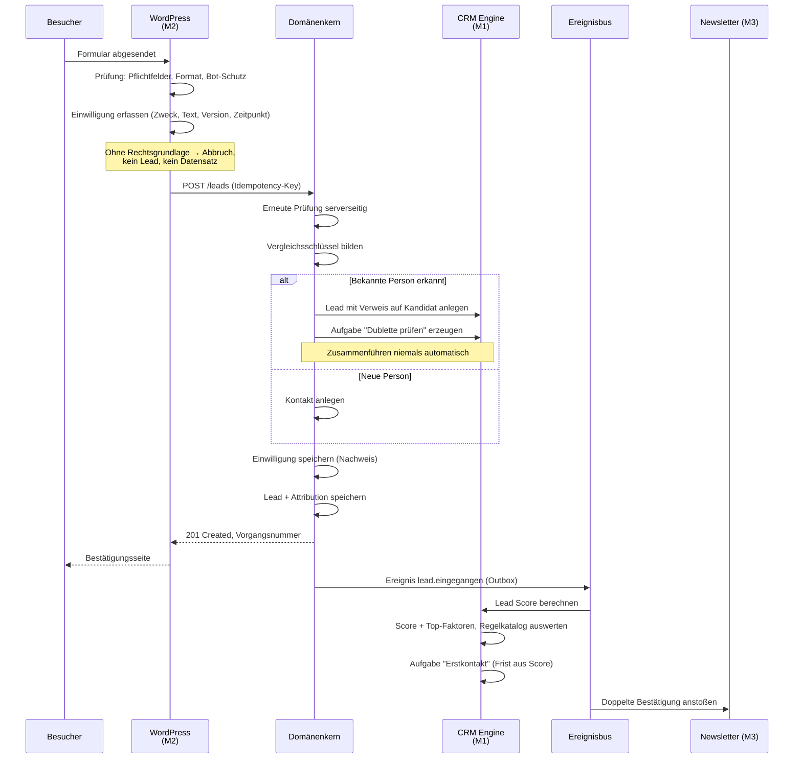
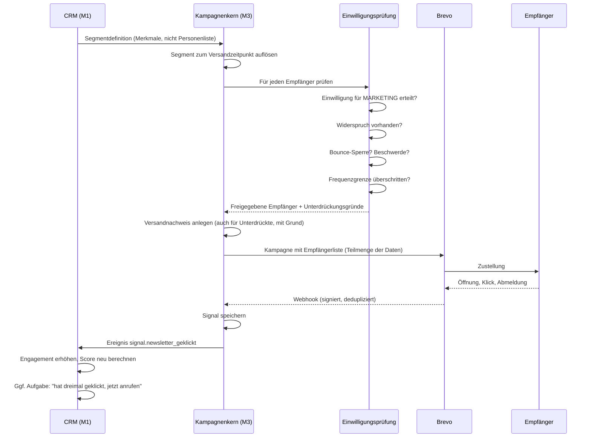
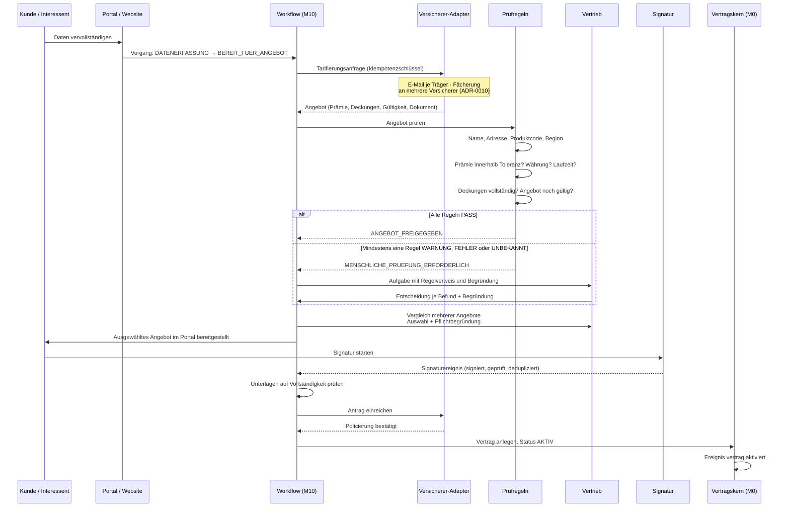
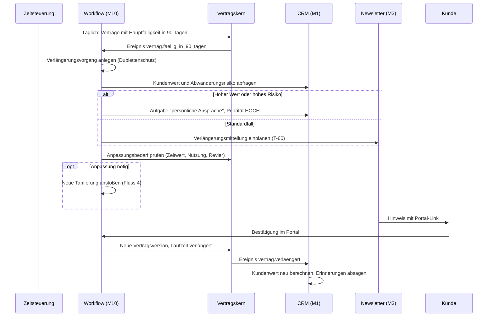

# 07 — Datenflüsse

Der Auftrag nennt fünf Flüsse. Sie bilden zusammen einen durchgehenden
Lebenszyklus — vom ersten Klick bis zur Verlängerung. Dieses Kapitel
beschreibt sie einzeln, dann als Ganzes, und zuletzt die Stellen, an denen
etwas schiefgeht.

---

## 0. Der Lebenszyklus im Überblick

```
    Sichtbarkeit          Interesse           Beziehung          Vertrag           Bindung
         │                    │                   │                 │                 │
    ┌────▼─────┐        ┌─────▼─────┐       ┌─────▼─────┐     ┌─────▼─────┐    ┌──────▼──────┐
    │ Kampagne │───────▶│   LEAD    │──────▶│  KONTAKT  │────▶│  VERTRAG  │───▶│ VERLÄNGERUNG│
    │ M2/M3    │        │    M1     │       │  KUNDE M0 │     │    M0     │    │     M10     │
    └──────────┘        └───────────┘       └───────────┘     └───────────┘    └──────┬──────┘
         ▲                                        │                                    │
         │                                        │                                    │
         └────────────────────────────────────────┴────────────────────────────────────┘
                        Signale, Scores und Segmente fließen zurück
```

Der Rückfluss ist der eigentliche Wert: Jede Stufe erzeugt Wissen, das die
vorherige Stufe verbessert. Ein Vertrag verrät, welche Kampagne wirklich
gewirkt hat. Eine Kündigung verrät, welches Signal sie angekündigt hätte.

---

## 1. Lead → CRM

### Ablauf



### Verbindliche Regeln

| Regel | Grund |
|---|---|
| Die Bestätigung an den Absender kommt **vor** allen nachgelagerten Schritten | Der Mensch wartet; Brevo, Scoring und Zuordnung dürfen ihn nicht warten lassen |
| Attribution wird **roh** gespeichert (`utm_*` unverändert) und zusätzlich aufgelöst | Rohdaten erlauben späteres Nachrechnen, wenn sich das Attributionsmodell ändert |
| Dubletten werden vorgeschlagen, nie zusammengeführt | Eine falsche Zusammenführung ist praktisch nicht rückgängig zu machen |
| Ohne Rechtsgrundlage entsteht kein Datensatz | Ein Lead ohne Nachweis ist unbenutzbar und ein Verstoß |
| Die Frist des Erstkontakts richtet sich nach dem Score | Ein A-Lead nach zwei Stunden, ein C-Lead am Folgetag — Wirkung folgt Geschwindigkeit |

### Fehlerfälle

| Fall | Verhalten |
|---|---|
| Kern nicht erreichbar | Formulareingang wird in WordPress zwischengespeichert, Absender erhält Bestätigung, Nachlauf sobald der Kern antwortet, Alarm nach 5 Minuten |
| Doppelte Absendung | `Idempotency-Key` verhindert den zweiten Lead |
| Bot-Verkehr | Ratenbegrenzung je Adresse, Honeypot-Feld, Zeitmessung. **Kein** Dienst, der Cookies Dritter setzt |
| Unvollständige Produktdaten | Lead entsteht trotzdem, Vorgang startet in `DATEN_UNVOLLSTAENDIG`, Nachfassaufgabe |

---

## 2. CRM → Newsletter

### Ablauf



### Verbindliche Regeln

| Regel | Grund |
|---|---|
| **Die Einwilligungsprüfung läuft im eigenen System, nicht bei Brevo** | Bei einem Anbieterwechsel bliebe der Nachweis sonst zurück |
| Auch der **unterdrückte** Versand wird protokolliert, mit Grund | Nur so ist belegbar, dass ein Widerspruch beachtet wurde |
| Segmente sind Definitionen, keine kopierten Listen | Eine kopierte Liste veraltet ab dem Moment des Kopierens |
| An Brevo geht die kleinstmögliche Datenmenge | Datenminimierung. Keine Verträge, keine Boote, keine Scores |
| Abmeldung wirkt sofort und systemweit | Ein Widerspruch, der nur eine Liste betrifft, ist keiner |
| Frequenzgrenze je Kontakt | Schutz vor Ermüdung und Beschwerden |

---

## 3. Newsletter → Kunde

Dieser Fluss ist der Übergang von Ansprache zu Handlung.

```
Newsletter enthält Handlungsaufruf
        │
        ├── "Angebot berechnen"  ──▶ Rechner auf S1 ──▶ Fluss 1 (neuer Lead)
        │
        ├── "Vertrag ansehen"    ──▶ Kundenportal M7 ──▶ Anmeldung ──▶ Vorgang
        │
        ├── "Verlängerung bestätigen" ──▶ Portal ──▶ Fluss 5
        │
        └── "Beratung anfordern" ──▶ Terminwunsch ──▶ Aufgabe für Vertrieb (M1)

Jeder Klick erzeugt ein SIGNAL mit:
    kontakt_id · quelle=NEWSLETTER · kampagne_id · ziel · zeitpunkt
        │
        └──▶ M1 Engagement-Berechnung
             └──▶ Score-Änderung
                  └──▶ ggf. Regelauslösung aus dem Regelkatalog
                       └──▶ Aufgabe mit Begründung
```

**Wichtig:** Der Newsletter verlinkt nie direkt auf ein Dokument. Er verlinkt
auf das Portal. Sensible Unterlagen verlassen die Plattform nicht als
E-Mail-Anhang und nicht als offener Link.

---

## 4. Kunde → Vertrag

### Ablauf



### Was sich durch die E-Mail-Anbindung ändert

Der Ablauf oben zeigt **einen** Träger. Als Mehrfachagent fächert sich der
Schritt „Tarifierungsanfrage" in mehrere ausgehende Mails auf, und es kommen
mehrere Angebote zurück. Dazwischen liegt ein Vergleichs- und Auswahlschritt mit
Pflichtbegründung. Die vollständige Darstellung steht in
[`11_ANBINDUNG_PRODUKTQUELLE.md`](11_ANBINDUNG_PRODUKTQUELLE.md) §3.

Zwei Folgen für diesen Fluss:

| Folge | Wirkung |
|---|---|
| Die Antwort kommt in Stunden bis Tagen, nicht in Sekunden | Der Kunde verlässt die Sitzung. Die zweite Sitzung ist der kritische Punkt — dort verliert man Interessenten an schnellere Wettbewerber |
| Es gibt keine Fehlermeldung | Ein Träger, der nicht antwortet, sieht aus wie ein Träger, der noch rechnet. Nur eine Fristüberwachung unterscheidet beides |

### Verbindliche Regeln

| Regel | Grund |
|---|---|
| **Eine automatische Prüfung führt nie allein zu einer nachteiligen Entscheidung** | Rechtliche Anforderung und fachlich richtig. `WARNUNG`, `FEHLER` und `UNBEKANNT` erzeugen eine Aufgabe |
| `UNBEKANNT` ist ausdrücklich kein `PASS` | Eine Regel, die nicht entscheiden konnte, hat nicht bestanden |
| Jedes Prüfergebnis speichert Regelcode, Version, Erwartung, Istwert, Begründung und Sicherheit | Ohne diese Angaben ist die Entscheidung nicht erklärbar |
| Die Signatur bindet an **genau eine** Dokumentversion | Sonst könnte eine später geänderte Fassung als signiert gelten |
| Einreichung nur mit Idempotenzschlüssel | Eine doppelte Einreichung erzeugt einen Doppelvertrag beim Kunden |
| Statuswechsel ausschließlich über benannte Übergänge | Kein allgemeiner Weg, einen Vertrag „auf aktiv zu setzen" |

---

## 5. Vertrag → Renewal Workflow

### Zeitachse

```
   Hauptfälligkeit
        │
   ─────┼──────────────────────────────────────────────────────────────▶
        │
  T-120 │ Bestandsprüfung: Vertrag, Boot, Wert, Schadenverlauf, Score
        │ ──▶ Kein Kundenkontakt. Nur interne Bewertung.
        │
   T-90 │ Auslöser: Verlängerungsvorgang wird angelegt
        │ ──▶ Aufgabe für Vertrieb bei hohem Kundenwert oder hohem Risiko
        │ ──▶ Prüfung: Anpassungsbedarf (Zeitwert, Nutzung, Revier)
        │
   T-60 │ Kundenansprache: Verlängerungsangebot im Portal + Hinweis-E-Mail
        │ ──▶ Bei erhöhtem Abwanderungsrisiko: persönlicher Anruf statt E-Mail
        │
   T-45 │ Kündigungsfrist naht ──▶ Eskalationsstufe 1
        │
   T-30 │ Keine Reaktion ──▶ Erinnerung + Aufgabe "persönlich kontaktieren"
        │
   T-14 │ Eskalationsstufe 2 ──▶ Aufgabe DRINGEND, Zuordnung an Betreuer
        │
    T-0 │ Hauptfälligkeit
        │ ──▶ bestätigt   → Vertrag verlängert, neue Vertragsversion
        │ ──▶ gekündigt   → Rückgewinnungsvorgang, Kündigungsgrund erfassen
        │ ──▶ keine Rückmeldung → gemäß Bedingungen; Vorgang bleibt offen
        │
   T+30 │ Bei Kündigung: Rückgewinnungsansprache
```

### Ablauf



### Verbindliche Regeln

| Regel | Grund |
|---|---|
| Vor jeder Erinnerung wird geprüft: Vorgang offen? Angebot gültig? Bereits bestätigt? Kommunikation zulässig? Bereits gesendet? | Fünf Prüfungen, fünf mögliche Fehler. Eine doppelte Mahnung an einen bereits verlängerten Kunden beschädigt die Beziehung mehr, als die Erinnerung nützt |
| Dublettenschutz über einen fachlichen Schlüssel | Ein zweimal laufender Nachtjob darf keine zweite Ansprache erzeugen |
| Hoher Kundenwert oder hohes Risiko schaltet auf persönlich um | Automatik dort, wo sie genügt; Mensch dort, wo es zählt |
| Der Kündigungsgrund wird immer erfasst | Ohne Grund keine Verbesserung |
| Fristen werden in der Zeitzone des Vertragslands gerechnet | `Europe/Vienna` und `Europe/Berlin` sind meist gleich, aber die Annahme ist trotzdem falsch zu treffen |

---

## 6. Querschnittsflüsse

### 6.1 Signale

```
QUELLE                    SIGNAL                          WIRKUNG in M1
─────────────────────────────────────────────────────────────────────────
Website-Besuch       ──▶  seite_besucht              ──▶  Engagement +
Rechner benutzt      ──▶  rechner_verwendet          ──▶  Kaufabsicht ++
Newsletter geöffnet  ──▶  newsletter_geoeffnet       ──▶  Engagement +
Newsletter geklickt  ──▶  newsletter_geklickt        ──▶  Engagement ++
Portal-Anmeldung     ──▶  portal_angemeldet          ──▶  Bindung +
Dokument geladen     ──▶  dokument_abgerufen         ──▶  Interesse +
Keine Aktivität      ──▶  stille_erkannt            ──▶  Abwanderungsrisiko ++
Zahlungsverzug       ──▶  zahlung_offen             ──▶  Abwanderungsrisiko +++
Boot verkauft        ──▶  objekt_veraeussert        ──▶  Abwanderungsrisiko +++
Schaden gemeldet     ──▶  schaden_gemeldet          ──▶  Betreuungsbedarf ++
Clubmitgliedschaft   ──▶  club_verknuepft           ──▶  Bindung +
```

Der Regelkatalog des Moduls `01_CRM_ENGINE` (A-01…A-49) legt fest, welche
Signalkombination welche Aufgabe erzeugt. Diese Architektur ändert daran nichts.

### 6.2 Dokumentfluss

```
Upload (Portal / Hub / Versicherer / erzeugt)
    │
    ├─▶ Prüfung: Typ am INHALT, Größe, Anzahl
    ├─▶ Ablage im Objektspeicher (verschlüsselt, privat)
    ├─▶ SHA-256 berechnen und speichern
    ├─▶ Status SCAN_OFFEN  ──▶ kein Zugriff möglich
    │
    └─▶ Virenprüfung (asynchron)
            ├─ sauber    ──▶ SCAN_SAUBER ──▶ freigegeben
            ├─ befallen  ──▶ Quarantäne, Alarm, Aufgabe, Absender informiert
            └─ Fehler    ──▶ Wiederholung, danach manuelle Prüfung

Abruf
    │
    ├─▶ Berechtigung auf OBJEKTEBENE prüfen
    ├─▶ Scanstatus prüfen
    ├─▶ Signierten Link erzeugen (≤ 5 Minuten, an Person gebunden)
    └─▶ Zugriff protokollieren (wer, wann, welche Version)
```

### 6.3 Ereignisfluss

```
Fachliche Änderung
    └─▶ Outbox (gleiche Transaktion)
            └─▶ Ereignisbus
                    ├─▶ CRM        (Score, Aufgabe)
                    ├─▶ Workflow   (Vorgang starten oder fortsetzen)
                    ├─▶ Kampagnen  (Anlass für Ansprache)
                    ├─▶ Analytics  (Zeitreihe)
                    └─▶ Konnektor  (Fremdsystem)
```

Ereignisnamen folgen `<bereich>.<vorgang>`, etwa `vertrag.aktiviert`. Sie
werden versioniert und niemals umbenannt: Ein Name im Protokoll ist ein
Versprechen an alle, die ihn auswerten.

---

## 7. Wo es schiefgeht — und was dann passiert

| Situation | Erkennung | Reaktion |
|---|---|---|
| Kern nicht erreichbar beim Formularversand | Zeitüberschreitung | Zwischenspeicher in WordPress, Bestätigung an den Absender, Nachlauf, Alarm |
| Brevo antwortet nicht | Fehlerquote am Konnektor | Warteschlange staut, Formulare laufen weiter, Alarm nach 30 Minuten |
| Versicherer antwortet nicht auf Tarifierung | **Fristüberwachung je Träger** — es gibt keine Fehlermeldung | Nach der zugesagten Antwortzeit: Aufgabe für den Innendienst mit Nachfassvorschlag. Bei zwei von drei Trägern ohne Antwort: Angebot aus den vorliegenden auswählen, nicht warten |
| Angebotsmail landet im Spam des Versicherers | Ausbleibende Antwort bei mehreren Vorgängen desselben Trägers | Zustellrate überwachen, SPF/DKIM/DMARC prüfen, Rückkanal telefonisch |
| Rücklaufmail nicht zuordenbar | Keine Vorgangsnummer im Betreff, kein `In-Reply-To` | Aufgabe für den Innendienst. **Nie stillschweigend verwerfen** — es wartet ein Kunde darauf |
| Doppeltes Signaturereignis | Eindeutiger Index auf Ereigniskennung | Protokolliert, nicht angewendet |
| Signatur auf veralteter Fassung | Prüfregel vor der Einreichung | Ablehnung, neue Signatur mit aktueller Fassung |
| Abgelaufenes Angebot wird bestätigt | Gültigkeitsprüfung im Übergang | Ablehnung mit Hinweis, Neuanfrage angeboten |
| Erinnerung nach Verlängerung | Fünffachprüfung vor Versand | Unterdrückt, mit Grund protokolliert |
| Verletzter Speicherzugriff | Berechtigungsprüfung auf Objektebene | `404`, Auditeintrag, bei Häufung Sperre und Alarm |
| KI antwortet nicht | Zeitgrenze | Vorlage statt Entwurf, kein Ablauf blockiert |
| Widerspruch nicht beachtet | Prüfung vor jedem Versand + nachträgliche Kontrolle | Versand unterbleibt; bei einem Verstoß Meldeprozess |
