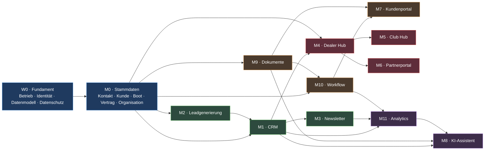

# 10 — Roadmap

## 1. Reihenfolgeprinzip

Die Reihenfolge folgt drei Regeln, in dieser Rangfolge:

| Nr. | Regel | Bedeutung |
|---|---|---|
| **F1** | **Zuerst, was andere blockiert.** | Ohne Kontakt, Kunde und Vertrag hat kein Portal etwas anzuzeigen. Fundament vor Fassade. |
| **F2** | **Danach, was am schnellsten Geld verdient.** | Lead → CRM → Newsletter ist die kürzeste Strecke von Aufwand zu Umsatz. Sie kommt vor allem Übrigen. |
| **F3** | **Zuletzt, was verstärkt.** | KI und Analytics machen Vorhandenes besser. Ohne Vorhandenes machen sie nichts. |

**Nicht** nach Reihenfolge gebaut wird nach Aufwand („erst das Einfache") oder
nach Begeisterung („erst die KI"). Beides führt zu einer Plattform, die
beeindruckt und nichts trägt.

---

## 2. Abhängigkeitsgraph



### Kritischer Pfad

```
W0 ──▶ M0 ──▶ M1 ──▶ M10 ──▶ M7
```

Alles auf diesem Pfad verzögert alles Nachfolgende. Alles daneben ist
parallelisierbar oder verschiebbar.

---

## 3. Wellen

### Welle 0 — Fundament

> **Ziel:** Die Plattform kann gebaut, betrieben und geprüft werden.
> **Sichtbares Ergebnis für das Geschäft:** keines. Das ist beabsichtigt.

| Ergebnis | Warum jetzt |
|---|---|
| Hostingentscheidung, Umgebungen, Auslieferungskette | Ohne Entscheidung kein Betrieb (**A-03**) |
| Identitätsanbieter, Rollen, Mehrfaktor | Jedes Modul braucht Anmeldung |
| PostgreSQL-Kernschema, Mandantentrennung, Migrationen | Nachrüsten wäre die teuerste aller Änderungen |
| Auditprotokoll, append-only | Ein Protokoll ohne Vergangenheit ist wertlos |
| Ereignisbus mit Outbox | Nachträgliche Entkopplung bedeutet, alles neu zu schreiben |
| WordPress-Grundinstallation, Theme, `core-bridge` | Grundlage jeder Oberfläche |
| Sicherung und erste Wiederherstellungsprobe | Eine ungeprobte Sicherung ist keine |
| Verzeichnis von Verarbeitungstätigkeiten, Datenschutzhinweise | Vor der ersten echten Person, nicht danach |

**Abnahme:** Eine Person meldet sich an, ein Datensatz wird angelegt, ein
Auditeintrag entsteht, die Datenbank wird aus der Sicherung wiederhergestellt.

**Risiko:** Diese Welle sieht nach nichts aus. Der übliche Fehler ist, sie zu
kürzen. Jede hier gesparte Woche kostet später Monate.

---

### Welle 1 — Wertschöpfung

> **Ziel:** Ein Interessent wird sichtbar, bewertet, angesprochen und
> nachverfolgt. Die Plattform verdient ihr erstes Geld.

| Modul | Umfang |
|---|---|
| **M0** | Kontakt, Kunde, Organisation, Boot, Vertrag — Erfassung und Pflege |
| **M2** | Öffentliche Website, Produktseiten, Rechner-Einstieg, Formular-Engine, Einwilligungen, Attribution |
| **M1** | Lead, Aktivität, Aufgabe, Lead Score, Customer Value Score, Regelkatalog, Priorisierung — Übernahme aus `01_CRM_ENGINE` |
| **M3** | Kampagne, Newsletter, Segmente, Brevo-Konnektor, Einwilligungsprüfung, Rücklaufsignale |

**Abnahme:** Ein Formular auf der Website erzeugt einen bewerteten Lead mit
Nachweis, der Vertrieb sieht ihn priorisiert in seiner Tagesliste, der Kontakt
erhält einen Newsletter, ein Klick verändert den Score.

**Damit ist der Fluss `Lead → CRM → Newsletter → Kunde` vollständig.**

**Voraussetzung ohne Alternative:** M1 ist bereits spezifiziert und als
PostgreSQL-Prototyp lauffähig. Diese Welle übernimmt ihn, statt ihn zu
entwerfen — das ist der größte Zeitvorteil der gesamten Roadmap.

---

### Welle 2 — Vertrag und Selbstbedienung

> **Ziel:** Aus einem Interessenten wird ein Vertrag, und der Kunde kann sich
> selbst bedienen.

| Modul | Umfang |
|---|---|
| **M9** | Dokumente, Versionen, Prüfsummen, Virenprüfung, signierte Links, Aufbewahrung |
| **M10** | Vorgangstypen Anfrage, Angebot, Antrag, Änderung, **Verlängerung**; Zustandsmaschinen, Fristen, Eskalationen |
| **M0+** | Vertragskern: Police, Deckung, Prämie, Vertragsversion, Verlängerungslogik |
| **M7** | Kundenportal: Verträge, Boote, Dokumente, Änderungen, Verlängerung bestätigen, Datenschutzanliegen |
| Adapter | Versicherer-Adapter: `Mock`, `Manuell`, `Real` als deaktiviertes Gerüst |
| Adapter | Signatur-Adapter: `Mock` und `Manuell` |

**Abnahme:** Ein Vorgang läuft vollständig von der Anfrage bis zum aktiven
Vertrag — über den Mock-Adapter. Der Kunde sieht ihn im Portal. Eine
Verlängerung startet 90 Tage vor Hauptfälligkeit von selbst.

**Damit ist der Fluss `Kunde → Vertrag → Renewal Workflow` vollständig.**

**Blockierend:** **A-01** (Produktquelle) und **A-04** (Signaturanbieter). Beide
verhindern nicht den Bau — die Adapterstruktur erlaubt die vollständige
Entwicklung ohne sie. Sie verhindern den **Produktivgang**. Deshalb müssen
beide Klärungen in Welle 1 beginnen, nicht in Welle 2.

---

### Welle 3 — Netzwerk

> **Ziel:** Händler, Clubs und Partner bringen Leads, die nichts kosten.

| Modul | Umfang |
|---|---|
| **M4** | Dealer Hub: Empfehlung, Status, Bestandsobjekte, Provisionsaufstellung, Unterlagen |
| **M5** | Club Hub: Clubprofil, Veranstaltungen, Mitgliederangebote, Gruppenkonditionen |
| **M6** | Partnerportal: Makler und Dienstleister, Aufträge, Abrechnung |

**Abnahme:** Ein Händler empfiehlt einen Interessenten, sieht dessen Status,
und die Vergütung erscheint nachvollziehbar in seiner Aufstellung.

**Warum diese Reihenfolge innerhalb der Welle:** M4 zuerst, weil der Dealer Hub
die vollständigste Ausprägung ist. M5 und M6 sind danach überwiegend
Konfiguration und Ansicht — das ist der Gewinn aus der Entscheidung, Händler,
Club und Partner als Rollen **einer** Organisation zu führen (ADR-0004).

---

### Welle 4 — Verstärkung

> **Ziel:** Aus Daten wird Erkenntnis, aus Erkenntnis wird Entlastung.

| Modul | Umfang |
|---|---|
| **M11** | Kennzahlen, Trichter, Kohorten, Kampagnenwirkung, Frühwarnung Abwanderung, Berichte |
| **M8** | KI-Assistent: Vorgangszusammenfassung, Kommunikationsentwurf, Dokumentextraktion, Portalauskunft |

**Abnahme:** Die Geschäftsführung sieht Kosten je Lead und je Abschluss nach
Kanal. Der Vertrieb erhält einen Entwurf, den er freigibt statt zu schreiben.

**Warum zuletzt:** Analytics ohne Daten misst nichts. Ein KI-Assistent ohne
Wissensbasis erfindet. Beide Module sind früh reizvoll und früh nutzlos.

**Blockierend für den Produktivgang:** **A-05** (Folgenabschätzung) und **A-07**
(Auftragsverarbeitung KI).

---

## 4. Was parallel laufen kann

| Strang | Inhalt | Bedingung | Team |
|---|---|---|---|
| **A — Kern** | M0, M1, M10, Vertragskern | kritischer Pfad, nie unterbrochen | Backend |
| **B — Oberfläche** | Website, Theme, Portale, Formular-Engine | braucht nur die API-Verträge, nicht deren Umsetzung | Frontend, Redaktion |
| **C — Integration** | Brevo, Power Automate, Versicherer, Signatur, Google, LinkedIn | braucht nur die Adaptergrenzen | Integration |
| **D — Betrieb** | Hosting, Auslieferung, Überwachung, Sicherung, Härtung | von Welle 0 an durchgehend | Betrieb |
| **E — Compliance** | Verzeichnis, Folgenabschätzung, Auftragsverarbeitung, Löschkonzept, Zulassung | **von Tag eins, nicht am Ende** | Datenschutz, Recht |
| **F — Inhalt** | Produkttexte, Ratgeber, SEO, Bildmaterial, E-Mail-Vorlagen | unabhängig von aller Technik | Marketing |

### Die entscheidende Bedingung für Parallelität

**Die API-Verträge müssen vor der Umsetzung stehen.** Sobald OpenAPI-Definition
und Ereignisnamen festgeschrieben sind, kann Strang B gegen einen Mock
entwickeln und Strang C gegen einen Mock integrieren — ohne auf Strang A zu
warten.

Wird diese Bedingung verletzt, kollabieren sechs Stränge auf einen, und die
Roadmap verlängert sich um ein Vielfaches. Das ist der wichtigste einzelne
Steuerungspunkt des gesamten Vorhabens.

---

## 5. Meilensteine

| # | Meilenstein | Nachweis | Nach Welle |
|---|---|---|---|
| **MS-1** | Plattform betreibbar | Anmeldung, Auditeintrag, Wiederherstellung belegt | 0 |
| **MS-2** | Erster Lead durchgängig | Formular → bewerteter Lead → Tagesliste | 1 |
| **MS-3** | Erste Kampagne versendet | Segment → Versand → Rücklauf → Score verändert | 1 |
| **MS-4** | Erster Vertrag über Mock | Anfrage → Angebot → Prüfung → Freigabe → Signatur → Vertrag | 2 |
| **MS-5** | Kundenportal live | Kunde sieht Vertrag, lädt Dokument, bestätigt Änderung | 2 |
| **MS-6** | Erste Verlängerung automatisch | 90-Tage-Auslöser → Ansprache → Bestätigung → neue Version | 2 |
| **MS-7** | Erste echte Produktivanbindung | Versicherer-Adapter real, Produktivgang freigegeben | 2/3 |
| **MS-8** | Erster Partner produktiv | Händler empfiehlt, sieht Status, erhält Abrechnung | 3 |
| **MS-9** | Steuerung auf Zahlen | Kosten je Lead und je Abschluss nach Kanal | 4 |
| **MS-10** | KI im Alltag | Entwurf angenommen statt selbst geschrieben, mit Protokoll | 4 |

---

## 6. Was wann geklärt sein muss

Klärungen dauern länger als Programmierung, weil sie von anderen abhängen.
Deshalb beginnen sie früher, als es nötig erscheint.

| Offener Punkt | Klärung beginnt | Muss vorliegen vor | Folge bei Verzug |
|---|---|---|---|
| **A-03** Hosting und Region | sofort | Welle 0 | Nichts kann beginnen |
| **A-02** Gewerberechtliche Zulassung | sofort | erstem öffentlichem Angebot | Kein Vertrieb erlaubt |
| **A-01** Produktquelle und Anbindung | sofort | MS-7 | Dauerhaft manueller Betrieb |
| **A-07** Auftragsverarbeitung (Brevo, Microsoft, KI) | Welle 0 | MS-3 beziehungsweise MS-10 | Kein Versand, keine KI |
| **A-04** Signaturanbieter und Stufe | Welle 1 | MS-4 produktiv | Papierprozess |
| **A-05** Datenschutz-Folgenabschätzung | Welle 1 | Produktivgang M1 | Scoring nicht einsetzbar |
| **A-06** Zahlungsabwicklung | Welle 2 | Welle 3 | Versichererinkasso als Rückfall |

**Muster:** Sechs von sieben Punkten sind keine technischen Fragen. Sie
entscheiden trotzdem über den Termin. Wer die Roadmap steuern will, steuert
diese Tabelle — nicht die Programmierung.

---

## 7. Risiken der Umsetzung

| ID | Risiko | Wirkung | Gegenmaßnahme |
|---|---|---|---|
| **U-01** | Produktquelle bleibt dauerhaft ungeklärt | Manueller Betrieb bleibt | Der manuelle Adapter ist vollwertig und auditiert — kein Notbehelf, sondern eine tragfähige Betriebsart |
| **U-02** | WordPress-Anteil wächst schleichend, Fachdaten wandern in `wp_postmeta` | Die zentrale Trennung fällt, Sicherheit und Nachweisbarkeit sind verloren | Prinzip P1 ist ADR und wird in der Codeprüfung durchgesetzt; kein Fachdatum in WordPress-Tabellen |
| **U-03** | Compliance beginnt erst am Ende | Produktivgang verschiebt sich um Monate | Strang E läuft ab Tag eins |
| **U-04** | Frühzeitiger Bau von M8 und M11 | Aufwand ohne Datengrundlage | Wellenreihenfolge ist verbindlich |
| **U-05** | API-Verträge entstehen erst mit der Umsetzung | Parallelisierung entfällt, Termin vervielfacht sich | Vertragsdefinition ist Ergebnis von Welle 0, nicht von Welle 1 |
| **U-06** | Saisonspitze trifft eine ungetestete Plattform | Ausfall zum wichtigsten Zeitpunkt | Lasttest vor März; das CRM-Modul liefert bereits ein Lastprofil |
| **U-07** | Zu viele Plugins | Angriffsfläche, Aktualisierungslast | Plugin-Freigabeprozess mit festen Kriterien |
| **U-08** | Doppelte Datenhaltung zwischen WordPress und Kern | Widersprüchliche Wahrheiten | Prinzip P2: je Datum genau ein System of Record, dokumentiert in Kapitel 04 |
| **U-09** | Händler und Clubs nutzen die Hubs nicht | Welle 3 ohne Wirkung | Vor dem Bau: drei Pilotpartner verbindlich gewinnen |
| **U-10** | Migration von Altdaten unterschätzt | Verzug in Welle 1 | Datenqualität früh prüfen; Migration ist ein eigener Strang, kein Nebenprodukt |

---

## 8. Empfehlung

| Sofort beginnen | Warum |
|---|---|
| Hostingentscheidung treffen (**A-03**) | Blockiert alles |
| Gespräch mit der Produktquelle aufnehmen (**A-01**) | Längste Vorlaufzeit von allen Punkten |
| Datenschutzbeauftragte Person einbinden | Läuft parallel und verhindert später Stillstand |
| Rechtliche Prüfung der Zulassung (**A-02**) | Ohne sie kein öffentlicher Vertrieb |
| API-Verträge und Ereignisnamen festschreiben | Einziger Hebel für echte Parallelität |

| Bewusst später | Warum |
|---|---|
| KI-Assistent | Verstärkt Vorhandenes; ohne Vorhandenes wirkungslos |
| Analytics-Ausbau | Misst nichts ohne Daten |
| Kubernetes und Mehrregionenbetrieb | Betriebsaufwand ohne Gegenwert bei V1-Last |
| Schaden und Provisionsabrechnung | Eigene Domänen, eigene Architekturphase |
| Weitere Länder über AT und DE hinaus | Erst wenn ein Markt trägt |

---

## 9. Nächster Schritt nach dieser Phase

Diese Phase liefert die Architektur. Der nächste Schritt ist **nicht**
Programmierung, sondern:

1. **Freigabe dieses Dokumentensatzes** durch Geschäftsführung und
   Datenschutz — mit ausdrücklicher Entscheidung zu ADR-0001 (WordPress als
   Experience Layer) und ADR-0002 (Symfony als Domänenkern).
2. **Schließen der Punkte A-01 bis A-03**, weil sie den Terminplan bestimmen.
3. **Phase `02_DETAILDESIGN`**: API-Verträge, OpenAPI-Definition,
   Ereigniskatalog, Datenbankschema als ausführbares DDL, Oberflächenkonzept.
   Erst danach beginnt die Umsetzung von Welle 0.
