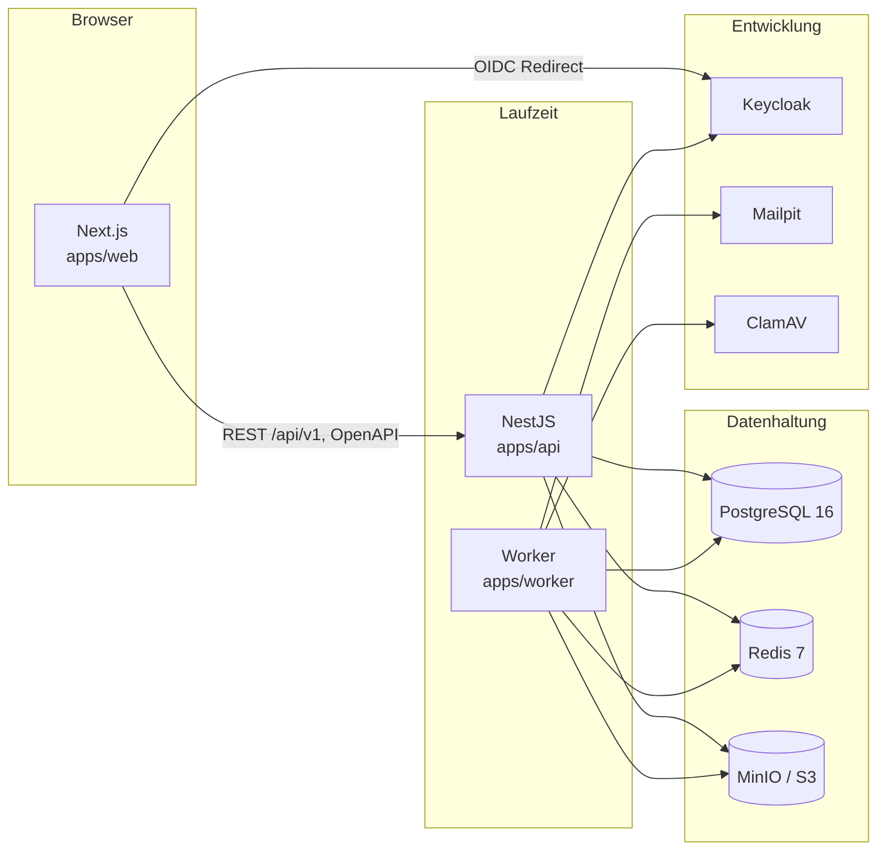
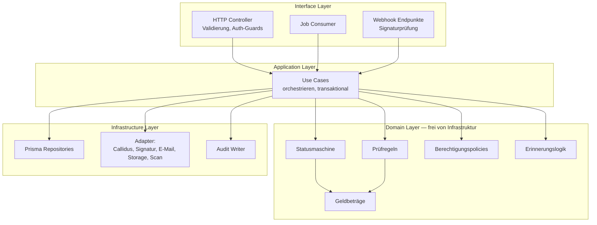

# Container- und Modulübersicht

## Container

`apps/worker` teilt sich das Prisma-Schema und die Domänenpakete mit `apps/api`,
läuft aber als eigener Prozess. Das ist keine Microservice-Architektur: es ist
**ein** Deployment-Artefakt mit zwei Einstiegspunkten, damit lange Jobs die
HTTP-Latenz nicht beeinflussen.

## Module im Monolithen

**Abhängigkeitsregel:** Pfeile zeigen ausschließlich nach unten oder zur Seite.
Der Domain Layer importiert weder Prisma noch NestJS noch einen Adapter. Er ist
ohne Datenbank testbar.

## Fachliche Module (NestJS-Module, jeweils eigener Ordner)

| Modul           | Verantwortung                                   | Besitzt Tabellen                                                                  |
| --------------- | ----------------------------------------------- | --------------------------------------------------------------------------------- |
| `identity`      | Benutzer, Rollen, Berechtigungen                | `User`, `Role`, `Permission`, `UserRole`                                          |
| `customers`     | Personen, Adressen, Kontaktwege, Einwilligungen | `Customer`, `CustomerAddress`, `ContactMethod`, `Consent`, `PrivacyNoticeVersion` |
| `leads`         | Leads, Zuordnung, Quellen                       | `Lead`                                                                            |
| `cases`         | Versicherungsvorgang, Statusmaschine, Workflow  | `InsuranceCase`, `WorkflowInstance`, `WorkflowEvent`                              |
| `products`      | Produktdefinition, Schema, Feldmapping          | `ProductDefinition`, `ProductSchema`, `ProductFieldMapping`                       |
| `quotes`        | Angebotsanfrage, Angebot, Deckungen             | `QuoteRequest`, `QuoteRequestVersion`, `Quote`, `QuoteCoverage`, `QuoteExclusion` |
| `validation`    | Prüfläufe und Ergebnisse                        | `ValidationRun`, `ValidationResult`                                               |
| `documents`     | Dokumente, Versionen, Downloads                 | `Document`, `DocumentVersion`                                                     |
| `signatures`    | Signaturvorgänge, Ereignisse                    | `SignatureEnvelope`, `SignatureEvent`                                             |
| `tasks`         | Aufgaben, Erinnerungen, Eskalation              | `Task`                                                                            |
| `communication` | E-Mail, Portalnachricht, Vorlagen               | `Communication`                                                                   |
| `callidus`      | Adapter, Übertragungen, Ereignisse              | `CallidusTransmission`, `CallidusEvent`                                           |
| `audit`         | revisionssicheres Protokoll                     | `AuditEvent`                                                                      |
| `privacy`       | Aufbewahrung, Löschung, Datenexport             | `RetentionPolicy`, `DeletionRequest`, `DataExportRequest`                         |

Ein Modul greift **nie** direkt auf die Tabellen eines anderen Moduls zu,
sondern über dessen Service. Verstöße werden per Lint-Regel sichtbar gemacht.

## Pakete

| Paket                | Inhalt                                                | Von wem genutzt  |
| -------------------- | ----------------------------------------------------- | ---------------- |
| `@app/shared-types`  | Domänentypen, Statuswerte, Fehlerformat, DTO-Verträge | web, api, worker |
| `@app/validation`    | Zod-Schemata, gemeinsam für Client und Server         | web, api, worker |
| `@app/config`        | typisierte, validierte Umgebungskonfiguration         | api, worker      |
| `@app/callidus-sdk`  | Adapter-Interface, Mock, Manuell, Real (deaktiviert)  | api, worker      |
| `@app/signature-sdk` | `SignatureProvider`-Interface, Mock, Manuell          | api, worker      |
| `@app/email-sdk`     | E-Mail-Abstraktion, Vorlagen                          | worker, api      |
| `@app/ui`            | React-Bausteine, deutschsprachig, barrierearm         | web              |
