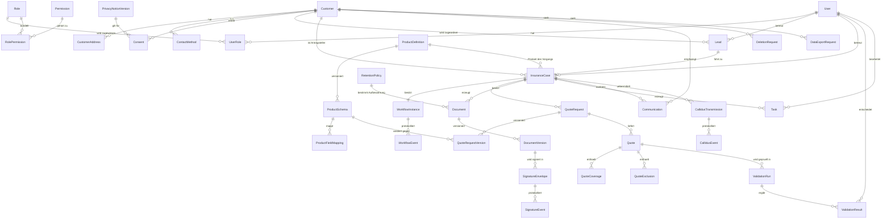
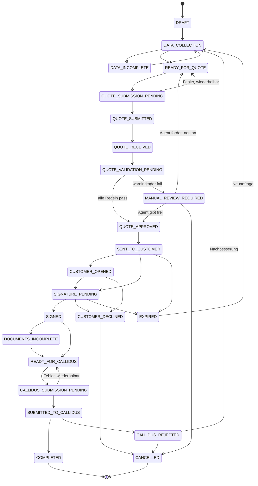

# Domänenmodell

## Leitentscheidungen

1. **Lead, Person und Vorgang sind getrennt.** Ein Lead ist eine vertriebliche
   Absicht und kann existieren, bevor eine Person zweifelsfrei identifiziert
   ist. Ein Vorgang (`InsuranceCase`) ist der prozessuale Kern und trägt die
   Statusmaschine.
2. **Kein universeller JSON-Klumpen.** Zentrale CRM-Felder sind relational.
   `JSONB` ist ausschließlich für produktspezifische Risikodaten zugelassen —
   mit JSON-Schema, gespeicherter Schemaversion und relational gespiegelten
   Suchfeldern.
3. **Angebotsdaten sind unveränderlich.** Eine Änderung erzeugt eine neue
   `QuoteRequestVersion` beziehungsweise ein neues `Quote`, niemals ein
   Überschreiben.
4. **Geldbeträge sind `Decimal(14,2)` mit Währung.** Kein Floating Point.
5. **Löschen ist ein Prozess, kein `DELETE`.** Siehe `docs/compliance/`.

## ER-Diagramm

`AuditEvent` steht bewusst ohne Fremdschlüsselkanten: es referenziert
Entitäten über `entityType` + `entityId`, damit das Protokoll auch dann
erhalten bleibt, wenn ein Datensatz anonymisiert wird.

## Statusmaschine des Vorgangs

Die maßgebliche, testbare Fassung dieser Maschine liegt als Datenstruktur in
`packages/shared-types` und wird in `apps/api` erzwungen. Das Diagramm ist die
Erläuterung, nicht die Quelle.

## Warum bestimmte Felder **nicht** existieren

| Nicht modelliert                      | Grund                                                                                                 |
| ------------------------------------- | ----------------------------------------------------------------------------------------------------- |
| Bankverbindung / IBAN                 | Im MVP für keinen Prozessschritt erforderlich (Datenminimierung). Aufnahme erst nach Beleg über F-16. |
| Gesundheitsdaten                      | Besondere Kategorie nach Art. 9 DSGVO. Kein dokumentierter Zweck im MVP.                              |
| Sozialversicherungsnummer / Steuer-ID | Kein Zweck im MVP.                                                                                    |
| Bonitätsdaten                         | Kein Zweck im MVP, würde Profiling-Anforderungen auslösen.                                            |
| Passwort-Hashes                       | Authentifizierung liegt beim OIDC-Provider.                                                           |
