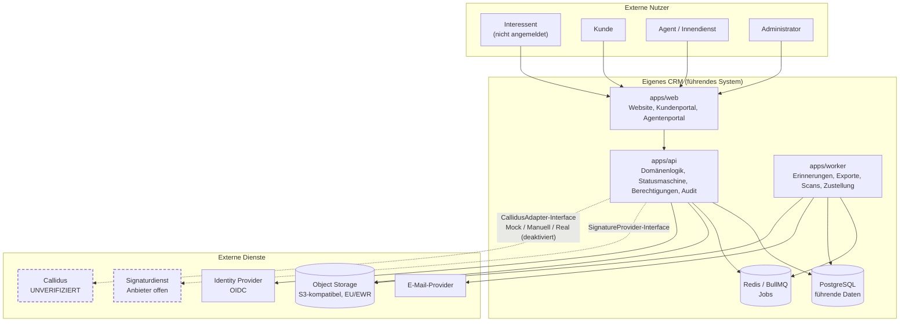

# Systemkontext

## Beteiligte

| Akteur / System   | Rolle                                          | Vertrauensstufe                                        |
| ----------------- | ---------------------------------------------- | ------------------------------------------------------ |
| Interessent       | füllt öffentliche Produktanfrage aus           | nicht authentifiziert                                  |
| Kunde             | nutzt das Kundenportal                         | authentifiziert, sieht nur eigene Vorgänge             |
| Agent             | bearbeitet Vorgänge, gibt Angebote frei        | authentifiziert, rollenbasiert                         |
| Innendienst       | unterstützt, ohne Freigaberecht für Angebote   | authentifiziert, eingeschränkt                         |
| Administrator     | konfiguriert Produkte, Regeln, Rollen          | authentifiziert, höchste Rechte, vollständig auditiert |
| **Callidus**      | externe Versicherungsplattform / Produktquelle | extern, **unverifiziert**                              |
| Signaturdienst    | elektronische Signatur                         | extern, Anbieter offen                                 |
| E-Mail-Provider   | Zustellung von Benachrichtigungen              | extern                                                 |
| Object Storage    | Dokumentablage (S3-kompatibel, EU/EWR)         | extern, verschlüsselt                                  |
| Identity Provider | OIDC-Anmeldung, MFA                            | extern                                                 |

## Kontextdiagramm

Gestrichelte Kanten bedeuten: **Adaptergrenze, hinter der derzeit kein
verifizierter Partner steht.** Im MVP endet jede dieser Kanten in einem Mock
oder in einem dokumentierten manuellen Prozess.

## Datenhoheit

| Datum                                    | Eigentümer                                            | Begründung                                      |
| ---------------------------------------- | ----------------------------------------------------- | ----------------------------------------------- |
| Person, Adresse, Kontaktweg              | eigenes CRM                                           | führendes System                                |
| Einwilligung, Datenschutzhinweis-Version | eigenes CRM                                           | Nachweispflicht liegt beim Verantwortlichen     |
| Lead, Vorgang, Status, Aufgabe           | eigenes CRM                                           | Prozesshoheit                                   |
| Produktdefinition und Feldschema         | eigenes CRM (aus Callidus-Angaben gepflegt)           | muss versioniert und auditierbar sein           |
| Prämie, Tarif, Deckung                   | Callidus (fachlich), Kopie im CRM                     | Berechnung liegt bei der Versicherungsplattform |
| Dokumentinhalt                           | Object Storage                                        | keine Binärdaten in der Datenbank               |
| Signaturnachweis                         | Signaturdienst (Original), Status + Ereignisse im CRM | Beweiskraft liegt beim Anbieter                 |
| Audit-Protokoll                          | eigenes CRM, unveränderlich                           | Revisionsfähigkeit                              |
